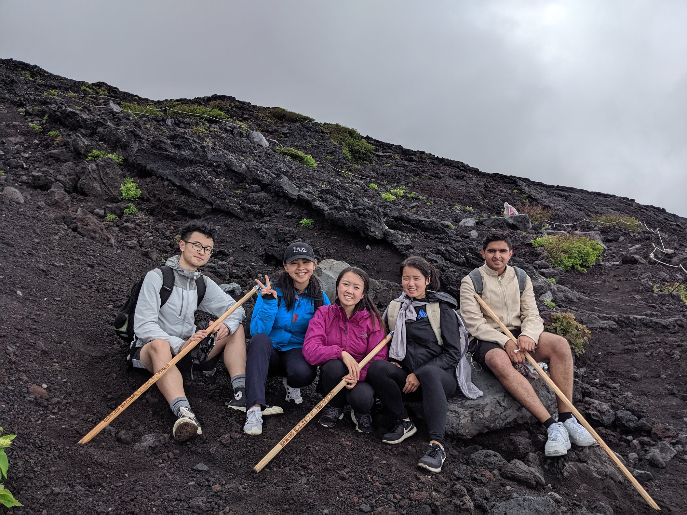
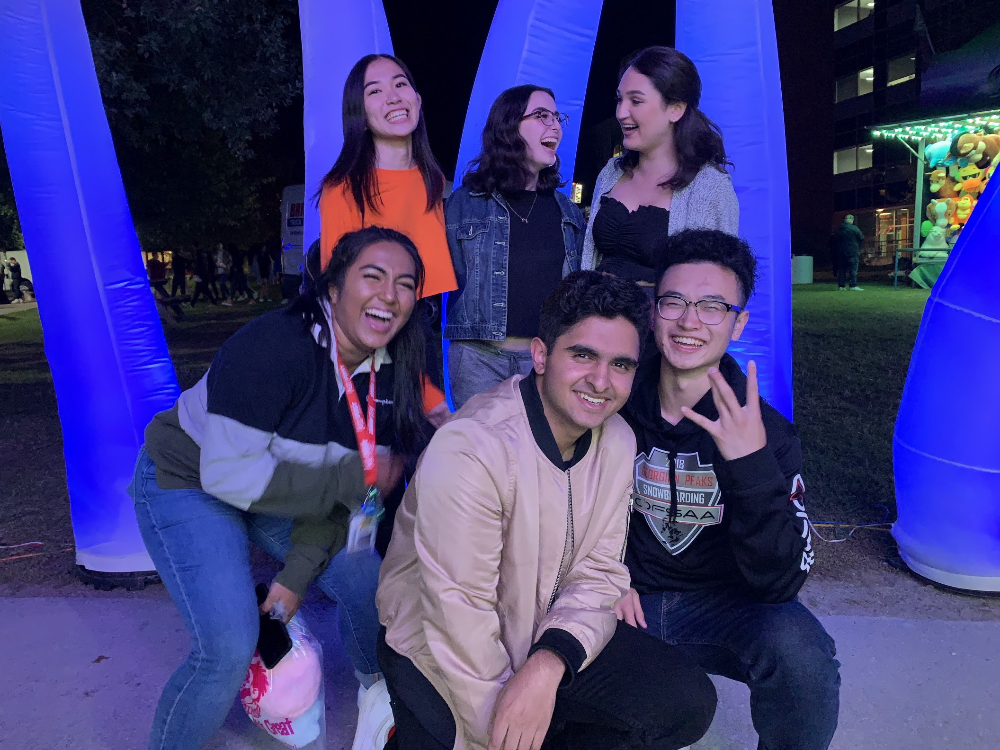
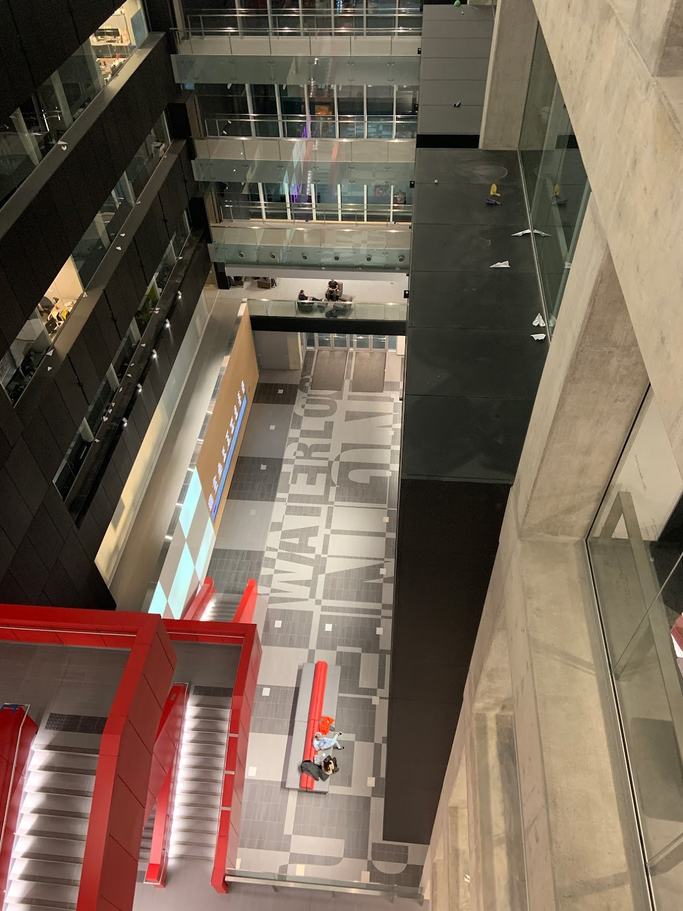

# My Story

## Summer 2019

I don't really have one of those crazy stories of not knowing what I wanted to do, and giving a risky major a try. Since around the 8th grade, I've known not only that I wanted to study Software Engineering, but also that I would do it at Waterloo. Unsurprisingly, I decided to accept an offer to study Software Engineering at the University of Waterloo. After graduating highschool, I spent most of my summer in Japan with my friends, and just generally having fun. Japan was beautiful. Here's some of the beautiful people I got to explore it with.

## Fall 2019 - 1A

My Waterloo journey began in September of 2019. I spent most of my time meeting new people and making friends. I lived in CMH, one of the nicer buildings at Waterloo, and most of the friends I made were people on my floor.

By nature of the types of people who get in, it's easy to feel like you're lacking in SE. It's a little bit intimidating, but most people are really kind. I also found that the stereotypes about SE kids being sweaty and never having fun wasn't true. We would party until 3 or 4 in the morning and then wake up at 8 again to go to class. The work hard play hard culture is really fun, but it honestly isn't sustainable. I didn't sleep a whole lot in 1A, and I went to every lecture of every class. This meant I did pretty well in school, but not without putting in the work.

## Winter 2020 - 1B

Most of 1B was pretty similar to 1A. I got a lot closer with my newly made friends in university, and spent a lot of my time grinding leetcode. I started going to class less frequently, and focused more on finding my first coop. During my first ever technical interview, I was asked to write a function that determines if a word is a palindrome. Even though I thought the interview went well, I didn't get the job. I don't even remember the name of the company anymore. Eventually I did end up getting a job, even after showing up 15 minutes late to the interview and having a friend barge through the door while I was answering the programming question. I had seen the problem on leetcode the night before, so I was able to "come up" with it really quickly.

Here's a picture I took from the 7th floor of E7. I really like this building.

In March of 2020 this little pandemic called COVID-19 hit and everyone got sent home. Exams went online. I founded a group called SEFC. I broke up with my girlfriend. This wouldn't last for more that a month, right? Right? Wrong.

## Spring 2020 - 1B Coop (Work term #1, Localintel)

By some miracle my coop didn't get cancelled, and I got to work remotely from home. I worked for a company called Localintel, which makes "location marketing tools" for economic developers. To be honest, I had no idea what I was doing, and had never actually developed any real-world applicable programming skills. I kind of just improvised for the most part, and I was really stressed out. I started to feel pretty dejected when thinking about the working world, and for the first time I questioned whether this was something I could see myself doing in the future. Towards the end of the term my sister adopted 2 cats, which was a huge improvement to my mental health. I wish I took more pictures of them when they were babies.

## Fall 2020 - 2A

## Winter 2021 - 2A Coop (Work term #2, Carbonite)

## Spring 2021 - 2B

## Fall 2021 - 2B Coop (Work term #3, Shopify)

## Winter 2022 - 3A

## Spring 2022 - 3A Coop (Work term #4, Bloomberg)

## Fall 2022 - 3B

## Winter 2023 - 3B Coop (Work term #5, TBD)

## Spring 2023 - 4A

## Fall 2023 - 4A Coop (Work term #6, TBD)

## Winter 2024 - 4B

## Summer 2024
